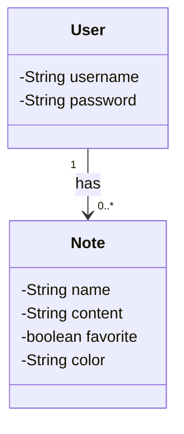

# cloud-spring-rest-api
Este projeto Java implementa uma API de To-Do List utilizando Spring 3 e Spring Data JPA. A API oferece um controlador para gerenciamento de usuários e um CRUD completo para tarefas (notes). As funcionalidades incluem a criação e leitura de usuários, além da criação, leitura, atualização e exclusão de tarefas associadas a esses usuários. A integração com Spring Data JPA permite uma interação eficiente com o banco de dados, utilizando Postgres como banco de dados de produção e H2 como banco de dados de desenvolvimento. O deploy e a integração contínua (CI/CD) da aplicação são gerenciados através da plataforma Railway, garantindo um ambiente de desenvolvimento e produção robusto e escalável.

## Diagrama de classes

